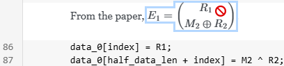

Copyright (C) 2025 Bryan A. Jones.

This file is part of the CodeChat Editor.

The CodeChat Editor is free software: you can redistribute it and/or modify it
under the terms of the GNU General Public License as published by the Free
Software Foundation, either version 3 of the License, or (at your option) any
later version.

The CodeChat Editor is distributed in the hope that it will be useful, but
WITHOUT ANY WARRANTY; without even the implied warranty of MERCHANTABILITY or
FITNESS FOR A PARTICULAR PURPOSE. See the GNU General Public License for more
details.

You should have received a copy of the GNU General Public License along with the
CodeChat Editor. If not, see
[http://www.gnu.org/licenses/](http://www.gnu.org/licenses/).

Changelog
================================================================================

[Github master](https://github.com/bjones1/CodeChat_Editor)
--------------------------------------------------------------------------------

* Update Graphviz to latest build; make Graphviz output a block element, not an
  inline element.
* Allow creating Mermaid and Graphviz diagrams using simpler code block syntax.
* Support math free of Markdown escaping. This is a backward-incompatible
  change: you must manually remove Markdown escaping from math written before
  this release.
* Fix failures when trying to edit a doc block which contains only diagrams.
* Fix data corruption bug after sending a re-translation back to the Client.
* Correct incorrect whitespace removal in Graphviz and Mermaid diagrams.

Version 0.1.43 -- 2025-Dec-05
--------------------------------------------------------------------------------

* Fix cursor movement errors in the Client.
* Prevent unnecessary saves of Client data to the IDE.

Version 0.1.42 -- 2025-Dec-04
--------------------------------------------------------------------------------

* Drag and drop of images creates a mess; disable drop and drop for this reason.
* Send sync data when doc blocks receive focus.
* Improve error handling.
* Improve method used to keep Client and IDE contents in sync.
* Correctly sync when IDE files are updated when editing in the Client.
* Fix data corruption bug when creating new doc blocks in the Client --
  whitespace was lost.
* Update line numbering in the Client when word wraps occur in a doc block.
* Avoid unnecessary saves from the Client just after receiving new data.
* Reduce delay between Client edits and IDE updates.
* Increase time errors messages are displayed in the Client.

Version 0.1.41 -- 2025-Nov-17
--------------------------------------------------------------------------------

* Math now renders in the active doc block, as shown below.
* Math is now protected from accidental edits in the Client:
  
* Improved synchronization between the cursor and scroll position of the Client
  and IDE.
* Removed accidental debug output.
* Remove unnecessary TinyMCE plugins.

Version 0.1.40 -- 2025-Nov-11
--------------------------------------------------------------------------------

* File watcher now accepts new files from the Client.
* Improved translation from HTML to Markdown.
* Build correct binary for Mac M1.
* Add CodeMirror support for SQL and YAML.

Version 0.1.39 -- 2025-Oct-23
--------------------------------------------------------------------------------

* Scroll viewport to center on cursor movement.
* Significant improvements to test framework.
* Improved build framework.
* Refactor IDE interface back into the Server.

Version 0.1.38 -- 2025-Sep-24
--------------------------------------------------------------------------------

* Automatically find a free port for the Client, instead of requiring the user
  to specify it in the VSCode settings.
* Remove unused VSCode settings.
* Update code in the IDE when changes are made to the indent in the Client.
* Enable spell checking in doc blocks. Note that the VSCode browser doesn't
  support spell checking.
* Improved build process.

Version 0.1.37 -- 2025-Sep-22
--------------------------------------------------------------------------------

* Fix: avoid loading the same file twice in a row when the user clicks on a link
  in the Client.
* Improve VSCode connection with the Server.

Version 0.1.36 -- 2025-Sep-17
--------------------------------------------------------------------------------

* The system continues to work after a PC goes to sleep then wakes back up;
  communication within previous versions fails after a sleep/wake up cycle.
* Communicate between the VSCode extension and the Server using queues instead
  of a websocket and a queue.
* Remove the HTML editor's toolbar, to free up more space on the screen.
* Add a code formatting button to the quick toolbar which appears when tex is
  selected in the HTML editor.
* Remove the File entry from the HTML editor's main menu.

Version 0.1.35 -- 2025-Sep-12
--------------------------------------------------------------------------------

* Embed the CodeChat Editor Server inside the VSCode extension, rather than
  running it as a standalone binary.
* Fixes to the build process.

Version 0.1.34 -- 2025-Sep-08
--------------------------------------------------------------------------------

* Make the Client text editable again. Improve handling of selections.
* In VSCode, load a new file in the Client after a short delay, rather than
  immediately. This provides a more efficient process when changing files.

Version 0.1.33 -- 2025-Sep-02
--------------------------------------------------------------------------------

* Change `<graphviz-graph>` syntax, which now correctly translates from the
  Client to source code, avoiding data loss in previous versions.
* Make the Client text editable from the IDE by fixing a bug introduced in
  v0.1.32.
* Significantly reduce the size of the MathJax package.
* Correct a data loss bug when deleting multiple sequential doc blocks.

Version 0.1.32 -- 2025-Sep-01
--------------------------------------------------------------------------------

* Improve tooling for VSCode extension.
* Improve selection handling in the Client.

Version 0.1.31 -- 2025-Aug-31
--------------------------------------------------------------------------------

* Correct EOL handling on Windows which caused data corruption.

Version 0.1.30 -- 2025-Aug-30
--------------------------------------------------------------------------------

* Correct ordering of messages sent to and from the Framework to the Client.
* Fix and improve test framework and error reporting.
* Improve MathJax bundling.
* Update PDF viewer.

Version 0.1.29 -- 2025-Aug-23
--------------------------------------------------------------------------------

* Fix bugs in PDF viewer.
* Fix error when scrolling before a document is loaded.
* Fix debug print statements.

Version 0.1.28 -- 2025-Aug-13
--------------------------------------------------------------------------------

* Fix navigation in document-only mode.
* Improve errors reporting in the VSCode extension.

Version 0.1.27 -- 2025-Aug-05
--------------------------------------------------------------------------------

* Correctly handle document-only files.
* Update to the MathJax 4.0.0 release.
* Improve release process -- include release notes taken from the changelog.

Earlier releases
--------------------------------------------------------------------------------

* v0.1.26, 2025-Jul-31:
  * Additional data corruption fixes when applying edits.
  * Add more checks to detect data corruption.
  * Update the file watcher to support the diff protocol.
  * Send only changed fields when using the diff protocol.
  * Provide basic synchronization between the IDE and Client.
* v0.1.25, 2025-Jul-29:
  * Show notifications in Client when errors occur.
  * For safety, close the Client if applying edits fails.
* v0.1.24, 2025-Jul-25:
  * Fix indexing in diffs for characters that use more than one UTF-16 code
    unit, such as 😄,👉🏿,👨‍👦, and 🇺🇳.
  * Fix data corruption with adjacent doc blocks.
  * Translate line endings when loading a file from disk.
* v0.1.23, 2025-Jul-24
  * Correct diff errors in IDE with CRLF line endings.
  * Upgrade to newest release of MathJax, TinyMCE.
* v0.1.22, 2025-Jul-24
  * Better support for opening a page in a web browser.
  * Support HTTP basic authentication to restrict access; use
    `codechat-editor-server serve --auth username:password`.
  * Apply diffs to the IDE when available.
  * Better handling for CRLF line endings.
* v0.1.21, 2025-Jul-18:
  * Allow specifying the host address the server binds to.
  * Send server logs to the console by default.
* v0.1.20, 2025-Jul-18:
  * Correct data corruption in Client on delete/insert diff operations.
* v0.1.19, 2025-Jul-17:
  * Correctly apply diffs to Client document.
  * Avoid deleting adjacent doc blocks.
  * Correct error where edits in the IDE were ignored.
  * Provide in-browser feedback on Mermaid errors.
  * Fix word wrapping in Mermaid diagrams in lists.
* v0.1.18, 2025-Jul-14:
  * Send diffs to the Client, which prevents visual jitter.
* v0.1.17, 2025-Apr-14:
  * Fix heading level 3 and below word wrapping.
  * Correctly handle unclosed fenced code blocks.
* v0.1.16, 2025-Apr-11:
  * Fix to allow running inside a GitHub Codespace.
  * Add: new command-line option to open a file/directory --
    `codechat-editor-server start [filename/diretory]`.
* v0.1.15, 2025-Mar-31:
  * Correctly view binary files (images, PDFs, etc.) within a project.
  * Include support for viewing PDF files in VSCode.
* v0.1.14, 2025-Mar-13:
  * Correct translation of leading slash in Linux/OS X paths to/from a URL. This
    fixes rewrites of URL in Markdown to long relative paths.
* v0.1.13, 2025-Mar-10:
  * Show PDFs in the browser, instead of downloading them.
  * Update to new release of Actix framework.
* v0.1.12, 2025-Mar-08:
  * Fixed error when creating a new document in VSCode.
  * Fixed error when updating a non-CodeChat Editor document in VSCode.
* v0.1.11, 2025-Feb-27:
  * Fixed data corruption while editing math: typeset math, instead of LaTeX
    source, was saved to the source file. Now, math is untypeset during edits,
    then retypeset afterwards.
  * Correctly handle webview shutdown in VSCode extension.
* v0.1.10, 2025-Feb-20:
  * Update to the 2024 edition of Rust.
  * Update dependencies.
  * Update source formatting using current CodeChat Editor.
* v0.1.9, 2025-Jan-20:
  * Correct word wrapping inside Mermaid diagrams.
  * Correct translation after adding newlines to code blocks in the Editor.
  * Use setext headings, different symbols for bullets.
  * Drop prettier for word wrap.
* v0.1.8, 2025-Jan-12:
  * Correctly handle file not found in VSCode.
  * Correct filename handling on Windows.
* v0.1.7, 2025-Jan-08:
  * Fixed hyperlink navigation.
  * Fixed case-insensitive filename handling bugs.
  * Improve filename handling in tests.
* v0.1.6, 2024-Dec-29:
  * Improvements to the build tool.
  * Corrections to the C parser.
* v0.1.5, 2024-Dec-21:
  * Improvements to the build tool and tests.
  * Fixed filewatcher bugs.
* v0.1.4, 2024-Dec-19:
  * Added support for [Mermaid](https://mermaid.js.org/).
  * Fixed MathJax packaging.
  * Resize large images to fit in browser.
  * Switch to new parser for Python and C/C++.
  * Correct styles so that the selection and current line are visible.
  * Created a build tool to automate the build process and added CI checks.
  * Fixed OS-specific warnings and bugs.
  * Fixed filewatcher bugs.
* v0.1.3, 2024-Nov-18:
  * Switch to using MathJax 4 beta; load MathJax in the frame it's used, per
    [MathJax issue #3309](https://github.com/mathjax/MathJax/issues/3309).
  * Modernize graphviz-webcomponent build.
  * Move CSS to `client/src`.
* v0.1.2, 2024-Nov-12:
  * Fix [issue #28](https://github.com/bjones1/CodeChat_Editor/issues/28),
    autosave failures.
  * Fix filewatcher -- incorrect file path comparison.
  * Fix errors saving mathematics in Markdown-only files.
  * Improve spellchecking coverage.
  * Fix data loss when the CodeChat Editor Client is not visible.
* v0.1.1, 2024-Nov-04:
  * Added basic theme support; used a theme similar to Sphinx's Alabaster.
  * Added support for printing.
  * Added a user manual, improved documentation.
  * Fixed a bug in the filewatcher that prevented saving changes made in the
    Client.
  * Added math support.
  * Removed save button.
  * Added support for Kotlin.
  * Updates to the build system.
  * Cross-platform fixes.
* v0.1.0, 2024-Oct-16:
  * Initial release, with binaries for Windows only. Built with manually-patched
    CodeMirror per
    [this issue](https://github.com/bjones1/CodeChat_Editor/issues/27).
