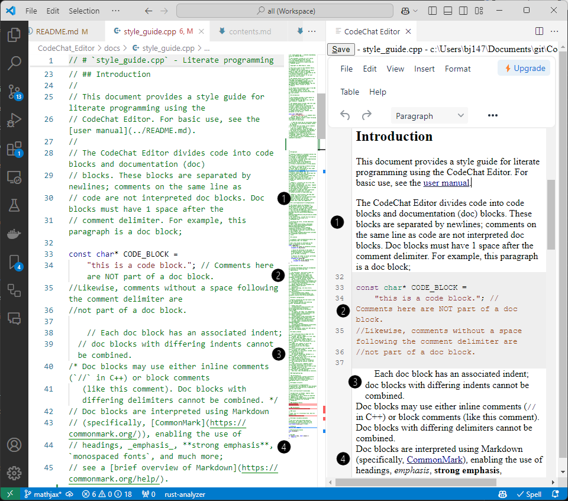
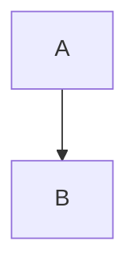
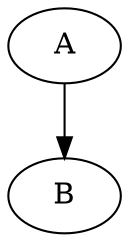

Welcome to the CodeChat Editor
================================================================================

The CodeChat Editor is a GUI-based programmer's word processor /
[Jupyter](https://jupyter.org/) for software developers. This document describes
its basic features and use. In contrast, the [style guide](docs/style_guide.cpp)
provides strategies for effectively employing the CodeChat Editor to improve the
software development process.

Full manual
--------------------------------------------------------------------------------

Read the
[manual rendered using the CodeChat Editor](https://codechat-editor.onrender.com/fw/fsb/opt/render/project/src/README.md),
since this documentation doesn't correctly render on GitHub.

Installation
--------------------------------------------------------------------------------

Install the
[CodeChat Editor extension for Visual Studio code](extensions/VSCode/README.md).
For developers, see [building from source](docs/design.md).

Structure
--------------------------------------------------------------------------------

The CodeChat Editor divides source code into code blocks and documentation (doc)
blocks. These blocks are separated by newlines; the image below shows the
[style guide](docs/style_guide.cpp) on the left in the Visual Studio Code
(VSCode) text editor, while the right pane shows the same text from style guide
in the CodeChat Editor (using the VSCode extension). Specifically, this
screenshot shows:

* <span style="font-size: 20pt;">❶</span>: a doc block. Doc blocks must have one
  space after the comment delimiter.
* <span style="font-size: 20pt;">❷</span>: a code block. Comments on the same
  line as code are not interpreted as doc blocks.
* <span style="font-size: 20pt;">❸</span>: varying indents before a doc block.
* <span style="font-size: 20pt;">❹</span>: [Markdown](https://commonmark.org/)
  in a doc block; see a
  [brief overview of Markdown](https://commonmark.org/help/).



See the [style guide](docs/style_guide.cpp) for more examples.

Editing
--------------------------------------------------------------------------------

Edits may be made either in the IDE hosting the CodeChat Editor, or within the
CodeChat Editor window itself. Edits made in one place are transferred to the
other after a short delay.

Navigation
--------------------------------------------------------------------------------

Switching documents in the IDE likewise switches the document shown in the
CodeChat Editor. Likewise, following hyperlinks in the CodeChat Editor to a
local file loads that file in the IDE, as well as showing it in the Editor.

References to other files
--------------------------------------------------------------------------------

The CodeChat Editor supports hyperlinks to any recognized file type; to refer to
another source file, simply insert a hyperlink to it. For example,

| Source                                         | Rendered                            |
| ---------------------------------------------- | ----------------------------------- |
| `[docs/style_guide.cpp](docs/style_guide.cpp)` | [Style guide](docs/style_guide.cpp) |
| `[LICENSE.md](LICENSE.md)`                     | [License](LICENSE.md)               |

As usual, hyperlinks are relative to the current file; to refer to the style
guide, use `docs/style_guide.cpp`, since this file resides in the `docs/`
subdirectory:

```
README.md (this file)
LICENSE.md
docs/
  style_guide.cpp
  monitor.png
```

Images
--------------------------------------------------------------------------------

Likewise, the path to local images is relative to the current file's location
(see the preceding diagram for the location of `monitor.png`). For example
[\[1\]](#notes),

| Source                              | Rendered                          |
| ----------------------------------- | --------------------------------- |
| `` |  |

The CodeChat Editor disallows drag-and-drop of images, the result is a mess --
the image data is embedded directly in the source file. Avoid this; instead,
place images in a separate file, then reference them as shown above.

Projects
--------------------------------------------------------------------------------

The CodeChat Editor can either display a single file, or a project. In a
project, the table of contents is displayed on the left, while a file within the
project is displayed on the right. To create a project, simply place a file
named `toc.md` at the root of your project [\[2\]](#notes); its contents define
the table of contents. See the
[new project template](https://github.com/bjones1/CodeChat_Editor/tree/main/new-project-template)
for a simple example.

Mathematics
--------------------------------------------------------------------------------

The CodeChat Editor uses [MathJax](https://www.mathjax.org/) to support typeset
mathematics. Place the delimiters `$` immediately before and
after in-line mathematics; place `$$` immediately before
and after displayed mathematics. For example,

| Source                                        | Rendered                                    |
| --------------------------------------------- | ------------------------------------------- |
| `$x = \frac{-b \pm \sqrt{b^2 - 4ac}}{2a}$`    | $x = \frac{-b \pm \sqrt{b^2 - 4ac}}{2a}$    |
| `$$a^2$$`                                     | $$a^2$$                                     |

See [Latex Mathematics](https://en.wikibooks.org/wiki/LaTeX/Mathematics#Symbols)
for the syntax used to write mathematics expressions.

Diagrams
--------------------------------------------------------------------------------

### Mermaid

The CodeChat Editor supports diagrams created by
[Mermaid](https://mermaid.js.org/). For example,

<table>
  <thead>
    <tr>
      <th>Source</th>
      <th>Rendered</th>
    </tr>
  </thead>
  <tbody>
    <tr>
      <td>

````markdown

````

</td><td>


</td>
    </tr>
  </tbody>
</table>

The [Mermaid live editor](https://mermaid.live/) provide an focused environment for creating Mermaid chart.

### Graphviz

The CodeChat Editor supports diagrams created by
[Graphviz](https://graphviz.org/). For example,


<table>
  <thead>
    <tr>
      <th>Source</th>
      <th>Rendered</th>
    </tr>
  </thead>
  <tbody>
    <tr>
      <td>

````markdown

````

</td><td>


</td>
    </tr>
  </tbody>
</table>


Several on-line tools, such as [Edotor](https://edotor.net/), provide a focused editing experience.

### PlantUML

[PlantUML](https://plantuml.com/) transforms a hyperlink to a user-defined
diagram directly to an SVG; for example,

| Source                                                                                                                    | Rendered                                                                                                               |
| ------------------------------------------------------------------------------------------------------------------------- | ---------------------------------------------------------------------------------------------------------------------- |
| `` |  |

To edit these diagrams, paste the URL into the
[PlantUML web server](https://www.plantuml.com/plantuml/uml), click Decode URL,
edit, then copy and paste the SVG URL back to this file.

### Drawing programs

Images files produced by drawing programs can be included, as long as they can
be saved in a web-compatible format (PNG, SVG, JPG, GIF, etc.). For example, the
draw.io editor embeds source data into the resulting image, so the image below
can be directly edited by that package:


<a id="supported-languages"></a>Supported languages
--------------------------------------------------------------------------------

* C/C++
* C#
* CSS
* Go
* HTML
* Java/Kotlin
* JavaScript/ECMAScript and TypeScript
* JSON with comments ([JSON5](https://json5.org/))
* Markdown
* MATLAB
* Python
* Rust
* Shell scripts (`.sh`)
* SQL
* Swift
* TOML
* VHDL
* Verilog/SystemVerilog
* Vlang
* YAML

Issues and feature requests
--------------------------------------------------------------------------------

Please report issues and provide suggestions for improvement using the
[Github page for this project](https://github.com/bjones1/CodeChat_Editor).
Contributions to the code are welcome and encouraged!

License
--------------------------------------------------------------------------------

Copyright (C) 2025 Bryan A. Jones.

This file is part of the CodeChat Editor.

The CodeChat Editor is free software: you can redistribute it and/or modify it
under the terms of the GNU General Public License as published by the Free
Software Foundation, either version 3 of the License, or (at your option) any
later version.

The CodeChat Editor is distributed in the hope that it will be useful, but
WITHOUT ANY WARRANTY; without even the implied warranty of MERCHANTABILITY or
FITNESS FOR A PARTICULAR PURPOSE. See the GNU General Public License for more
details.

You should have received a [copy](LICENSE.html) of the GNU General Public
License along with the CodeChat Editor. If not, see
[https://www.gnu.org/licenses/](https://www.gnu.org/licenses/).

<a id="notes"></a>Notes
--------------------------------------------------------------------------------

1. The image used comes from
   [Monitor icons created by prettycons - Flaticon](https://www.flaticon.com/free-icons/monitor "monitor icons").
2. Note that the filename for the table of contents is lowercase; while the
   acronym is TOC, requiring upper-case naming can cause confusion when moving
   files between case-insensitive filesystems (Windows) and case-sensitive
   filesystems (Linux/OS X).
