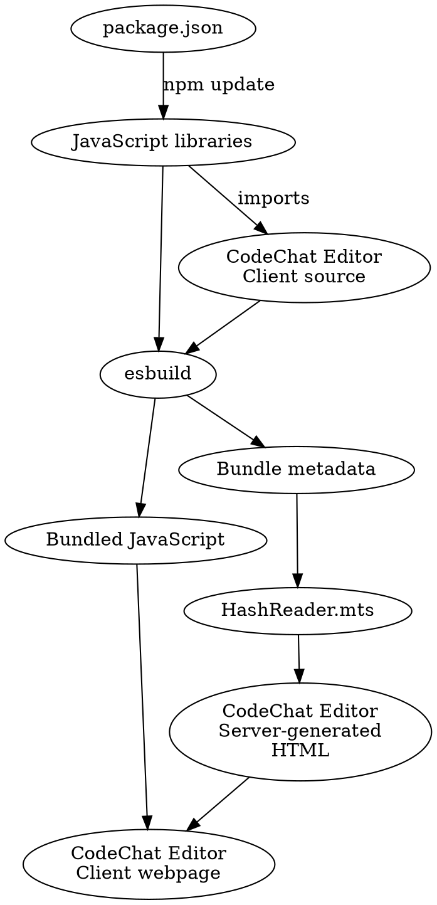

Copyright (C) 2025 Bryan A. Jones.

This file is part of the CodeChat Editor.

The CodeChat Editor is free software: you can redistribute it and/or modify it
under the terms of the GNU General Public License as published by the Free
Software Foundation, either version 3 of the License, or (at your option) any
later version.

The CodeChat Editor is distributed in the hope that it will be useful, but
WITHOUT ANY WARRANTY; without even the implied warranty of MERCHANTABILITY or
FITNESS FOR A PARTICULAR PURPOSE. See the GNU General Public License for more
details.

You should have received a copy of the GNU General Public License along with the
CodeChat Editor. If not, see
[http://www.gnu.org/licenses/](http://www.gnu.org/licenses/).

Implementation
================================================================================

### System architecture

```graphviz
digraph {
    bgcolor = transparent;
    compound = true;
    node [shape = box];
    subgraph cluster_text_editor {
        label = "Text editor/IDE"
        source_code [label = "Source\ncode", style = dashed];
        CodeChat_plugin [label = "CodeChat\nEditor plugin"];
    }
    subgraph cluster_server {
        label = <CodeChat Editor Server>;
        websocket_server [label = "Websocket\nserver"];
        web_server [label = "Web\nserver"];
    }
    subgraph cluster_client_framework {
        label = "CodeChat Editor Client framework"
        subgraph cluster_client {
            label = "CodeChat Editor Client"
            rendered_code [label = "Rendered document", style = dashed];
        }
    }
    CodeChat_plugin -> websocket_server [label = "NAPI-RS", dir = both, lhead = cluster_server];
    websocket_server -> rendered_code [label = "websocket", dir = both, lhead = cluster_client_framework];
    web_server -> rendered_code [label = "HTTP", dir = both, lhead = cluster_client ];
}
```

Inside the client:

* The Framework exchanges messages with the Server and loads the appropriate
  Client (simple view, PDF view, editor, document-only editor).
* The editor provides basic Client services and handles document-only mode.
* The CodeMirror integration module embeds TinyMCE into CodeMirror, providing
  the primary editing environment.

The entire VSCode interface is contained in the extension, with the NAPI-RS glue
in the corresponding library.

Does this make more sense to place in the TOC? Or is it too wordy there? I think
a diagram as an overview might be helpful. Perhaps the server, client, etc.
should have its of readme files providing some of this.

<a id="an-implementation"></a>Architecture
--------------------------------------------------------------------------------

Overall, the code is something like this:

### Client/server partitioning

Doc blocks consist of Markdown augmented with custom HTML elements which provide
authoring support. Some of these elements depend only on information in the
current page. For example, a GraphViz graph tag transforms the graph provided in
its tag into an SVG; it doesn't need information from other files. Other
elements, such as a cross-reference tag, depend on information from other pages
(in this case, the page containing the referenced item). The client lacks the
ability to access other files, while the server has direct access to these
files. Therefore, the overall strategy is:

* On page load, the server transforms custom tags which depend on information
  from other pages into tags which include this information. For example, a
  cross-reference tag might be transformed into a hyperlink whose link text
  comes from the cross-reference on another page.
* The client them defines a set of
  [Web Components](https://developer.mozilla.org/en-US/docs/Web/Web_Components)
  which implement custom tags which only need local information. For example, a
  GraphViz custom tag renders graphs based on a description of the graph inside
  the tag. Likewise, MathJax interprets anything in matching math delimiters
  (<span class="math math-inline mceNonEditable">...</span>, for example), then
  transforms it back to text before saving.
* On save, the client sends its text back to the server, which de-transforms
  custom tags which depend on information from other pages. If de-transforms
  disagree with the provided text, then re-load the updated text after the save
  is complete. For example, after inserting an auto-titled link, the auto-titled
  text is missing; a save/reload fixes this.

### Page processing pipeline

On load:

* Classify the file; inputs are mutable global state (which, if present,
  indicates this is a project build), if the file is a TOC, the file's binary
  data, and the file's path. Output of the classification: binary, raw text, a
  CodeChat document (a Markdown file), or a CodeChat file.

The load processing pipelines: for CodeChat files:

* (CodeChat files only) Run pre-parse hooks: they receive source code, file
  metadata. Examples: code formatters. Skip if cache is up to date.
* (CodeChat files only) Lex the file into code and doc blocks.
* Run post-parse hooks: they receive an array of code and doc blocks.
* Transform Markdown to HTML.
* Run HTML hooks:
  * Update the cache for the current file only if the current file's cache is
    stale. To do this, walk the DOM of each doc block. The hook specifies which
    tags it wants, and the tree walker calls the hook when it encounters these.
    If this requires adding/changing anything (anchors, for example), mark the
    document as dirty.
  * Update tags whose contents depend on data from other files. Hooks work the
    same as the cache updates, but have a different role. They're always run,
    while the cache update is skipped when the cache is current.
* Determine next/prev/up hyperlinks based on this file's location in the TOC.
* Transform the code and doc blocks into CodeMirror's format.

We want a clean separate between the webserver and the processing pipeline. The
webserver should provide I/O between the local file system and the client, but
do little processing. The processing pipeline should not perform I/O. Therefore:

* On load, the webserver receives a request for a file. It should gather and
  pass the following to the page processor:
  * The loaded file as text (or an Err result).
  * The global state (empty if this isn't a project build).
  * The pathname of the file.
  * If this file should be processed as a TOC or not.
* The page processor returns:
  * An Enum with the file's contents:

On save:

* Transform the CodeMirror format back to code and doc blocks.
* Run HTML hooks:
  * Update the cache for the current file. Mark the file as "dirty" (reload
    needed) if any changes are made.
  * Check tags whose contents depend on data from other files; if the contents
    differ, mark the file as dirty.
  * Transform HTML to Markdown.
* Run post-parse hooks; mark the file as dirty if any changes are made.
* De-lex the file into source code.
* Run pre-parse hooks; mark the file as dirty if any changes are made.
* Save the file to disk.
* If dirty, re-load the file.

### Cache data format

To think about:

1. For the current page, I need to keep a list of files this page depends on,
   then perform an update if any of these files changes.
2. I need a way to apply updates to the TOC. It also needs a list of files it
   depends on, getting an update when any dependency changes.
3. When is a file outdated? On startup, mark all files as needing to be checked.
   After checking and possibly re-loading, mark a file as current. On a file
   change notification, mark the file as out of date.
4. Store cache data to disk, reloading it as necessary, and updating as
   necessary.
5. Update the search engine only when the user performs a search. So, I need to
   keep a list of targets that were changed since the last search.
6. The text search engine needs to be able to search all text, even if not in
   the cache. So, we need a way to walk the filesystem and cache all files.
7. Hyperlinks that point to a special gathering element are tags. They can
   optionally include start and end query parameters to include more than the
   default chunk (the current doc block and the following code block, if the
   following block is a code block). Challenge: if the linked file's cache is
   old, indicating that the link isn't a tag gather, we have to re-process this
   file.
8. I need to index all files for a search and to ensure there are no global ID
   conflicts. But I don't need it for keeping auto-titled text updated; that's
   lazy.

Code changes elsewhere:

1. Longer-term: modify the pulldown-cmark HTML writer to preserve line numbers.
2. Write a driver function which calls upsert on the current file with
   auto-titles enabled and passes on the resulting text, but then start threads
   to load missing data and sends and update when these complete, perhaps also
   updating x seconds after each thread completes.
3. Revise the TOC loader to use mdbook's code to process and update the TOC.
4. While hydrating, we capture HTML, but this means we're capturing
   pre-hydration HTML. This is a problem: if the auto-titled text includes an
   equation, then it won't be translated yet! This is even worse for tags:
   diagrams are translated, etc. Probably need a multi-step process: hydrate;
   update code/doc blocks; update cache. This means that an auto-titled target
   whose text comes from another auto-titled item may not work; however, I think
   this is reasonable.
5. Steps
   1. HTML transformations that don't depend on the cache have no ordering:
      equations, diagrams. Perform these, storing contents for any targets
      encountered. Add auto-titled text to a list of items to resolve.
   2. After finishing HTML transformation, 
   3. Update doc blocks with transformed and auto-titled text.
   4. Use this to store tag information, then compute tags.

### IDE/editor integration

The IDE extension client (IDE for short) and the CodeChat Editor Client (or
Editor for short) exchange messages with each other, mediated by the CodeChat
Server. The Server forwards messages from one client to the other, translating
as necessary (for example, between source code and the Editor format).

#### Architecture

**Reviewed to here**

Clients always come in pairs: one IDE client is always paired with one CodeChat
Editor client. The server uses a set of queues to decouple websocket protocol
activity from the core processing needed to translate source code between a
CodeChat Editor Client and an IDE client. Specifically, one task handles the
receive and transmit function for the websocket:

* The task sends a periodic ping to the CodeChat Editor Client or the IDE
  client, then waits for a pong, closing the connection if the pong isn't
  received in a timely manner. This helps detect a broken websocket connection
  produced when a computer is put to sleep then wakes back up.
* Likewise, the task responds to a ping message from the CodeChat Editor Client
  by sending a pong in response.
* It tracks messages sent and produces an error message if a sent message isn't
  acknowledged within a timeout window.
* If the websocket is closed without warning, the websocket stores the relevant
  data so that it can resume when the client reconnects to it.
* If the websocket is closed purposefully (for example, by closing a CodeChat
  Editor Client tab in a web browser), the receive task detects this and shuts
  down the websocket along with the associated IDE client tasks.

To decouple these low-level websocket details from high-level processing (such
as translating between source code and its web equivalent), the websocket tasks
enqueue all high-level messages to the processing task; they listen to any
enqueued messages in the client or ide queue, passing these on via the websocket
connection.

Simplest non-IDE integration: the file watcher.

* On startup, it sends the current file to the CodeChat Editor.
* It uses a file watcher to send update commands when the current file changes.
* It writes a file to disk when it receives an update command.
* It closes the editor if the file is deleted or moved.

Simplest IDE integration:

* On startup, it sends the current file to the CodeChat Editor.
* It sends update commands if edits are made in the IDE, when scrolling, or when
  the active editor changes.
* It updates the IDE contents or opens a new file when it receives a update
  command.

More complex IDE integration: everything that the simple IDE does, plus the
ability to toggle between the IDE's editor and the CodeChat Editor.

Build system
--------------------------------------------------------------------------------

The app needs build support because of complexity:

* The client's NPM libraries need patching and some partial copying.
* After building a release for a platform, client/server binaries must be copied
  to the VSCode extension, then a release published for that platform.

So, this project contains Rust code to automate this process -- see the
[builder](../builder/Cargo.toml).

Misc topics
--------------------------------------------------------------------------------

### <a id="Client-simple-viewer"></a>CodeChat Editor Client Viewer Types

The Client supports several classes of files:

* Source files, rendered as intermingled code/doc blocks.
* Document-only files -- these contain only Markdown and typically have a file
  extension of `.md`.
* Unsupported text files -- the CodeChat Editor cannot edit some files, such as
  miscellaneous text files, unsupported languages, images, video, etc. The
  simple viewer displays (without allowing editing) these files as raw text in
  the browser, though wrapped in the appropriate project structure (with a TOC
  on the left).
* PDFs, where a plugin viewer for VSCode provides rendering, since the built-in
  browser doesn't.

### Broken fences (Markdown challenges)

All Markdown blocks are terminated by a blank line followed by unindented
content, except for fenced code blocks and some types of HTML blocks. To ensure
that doc blocks containing an opening fence but no matching closing fence, or a
start HTML tag but no closing tag, are properly closed (instead of affecting the
remainder of the doc blocks), the editor injects closing tags and fences after
each doc block, then repairs them (if needed, due to a missing closing fence) or
removed them. This means that some HTML tags won't be properly closed, since the
closing tags are removed from the HTML. This is fixed by later HTML processing
steps (currently, by TinyMCE), which properly closes tags.

Future work
--------------------------------------------------------------------------------

### Table of contents

* While the TOC file must be placed in the root of the project, it will be
  served alongside pages served from subdirectories. Therefore, place this in an
  iframe to avoid regenerating it for every page.

* The TOC is just Markdown. Numbered sections are expressed as nested ordered
  lists, with links to each section inside these lists.

* All numbering is stored internally as a number, instead of the corresponding
  marker (I, II, III, etc.). This allows styles to customize numbering easily.

  * Given an `a` element in the TOC, looking through its parents provides the
    section number. Given an array of section numbers, use CSS to style all the
    headings. Implement numbering using CSS variables, which makes it easy for a
    style sheet to include or exclude section numbers:

    `:root {` `--section-counter-reset: s1 4 s2 5;` `--section-counter-content:
    counter(s1, numeric) '-' counter(s2, numeric);` `}`

    `h1::before {` `counter-reset: var(--section-counter-reset);` `content:
    var(--section-counter-content);` `}`

#### Example of non-editable text

<div class="CodeChat-toc mceNonEditable" data-codechat-path="static/css/CodeChatEditor.css" data-codechat-depth="">
<p>asdf</p>
</div>

### Numbering

On a page, the local TOC numbering comes only from heading tags. The CSS (which
would adding numbering to selected headings) must be kept in sync with the code
which infers the numbering. A simple value (4, meaning h1-h4 are numbered) is
all the code needs. How to do this?

On the TOC, numbering may come from both heading tags and ordered lists, again
based on the CSS. Numbered headings should be included in the numbering,
followed by ordered list numbering.

### Settings

The settings should be configurable from a nice GUI. I like the VSCode idea --
make it easy to add more config values. Settings should also be available for
plug-ins. Store the config values in a bare JSON file; provide a web-based GUI
with descriptions of each setting.

* Files/directories to process/ignore
* Header/footer info (name, version, copyright, etc.)
* The programming language, markup language, and spellchecker language for each
  source file.
* Text wrap width when saving.
* Visual styling (theme/style sheets, color, fonts, size of TOC sidebar,
  location of sidebar, etc.).
* HTML `<head>` modifications: CSS/JS to add to all pages/a set of pages.
* Depth of headings to include in the page-local TOC.
* Auto-reload if modified externally or not
* Tabs vs spaces; newline type
* Substitutions

<a id="core-developmnt-priorities"></a>Core development priorities
--------------------------------------------------------------------------------

1. Bug fixes
2. Book support

### <a id="next-steps"></a>Next steps

1. Implement caching for all anchors/headings.
2. Implement author support: TOC, auto-titled links.
3. Implement a good GUI for inserting hyperlinks.
4. Better support for template literals.
5. Decide how to handle nested block comments.
6. Define the architecture for IDE extensions/plug-ins. Goal: minimize
   extension/plug-in complexity.
7. Define desired UI behavior. Priority: auto-reload; dirty document detection;
   auto-backup.
8. Propose visual styling, dark mode, etc.

### To do

1. Open the TOC as a single-file edit? If not, at least hide the sidebar, since
   that's redundant.

### Open questions

* I'd like to be able to wrap a heading and associated content in a `<section>`
  tag. This is hard to do -- if a heading appears in the middle of an indented
  comment, then need special processing (close the section, then the indent,
  then restart a new indent and section). In addition, it requires that code is
  nested inside doc blocks, which is tricky. However, I would like to do this.
* How to handle images/videos/PDFs/etc. when file are moved? Currently, we
  expect the user to move them as well. There's not an easy way to tag them with
  an unique ID, then refer to them using that ID than I can think of.
* Config file format: I really like and prefer Python's strictyaml. Basically, I
  want something that includes type validation and allows comments within the
  config file. Perhaps JSON with a pre-parse step to discard comments then
  [JSON Typedef](https://jsontypedef.com/)? Possibly, vlang can do this
  somewhat, since it wants to decode JSON into a V struct.

Organization
--------------------------------------------------------------------------------

### Client

As shown in the figure below, the CodeChat Editor Client starts with
`client/package.json`, which tells
[NPM](https://en.wikipedia.org/wiki/Npm_(software)) which JavaScript libraries
are used in this project. Running `npm update` copies these libraries and all
their dependencies to the `client/node_modules` directory. The CodeChat Editor
Client source code (see [CodeChatEditor.mts](../client/src/CodeChatEditor.mts))
imports these libraries.

Next, [esbuild](https://esbuild.github.io/) analyzes the CodeChat Editor client
based by transforming any [TypeScript](https://www.typescriptlang.org/) into
JavaScript then packaging all dependencies (JavaScript, CSS, images, etc.) into
a smaller set of files. At a user's request, the CodeChat Editor Server
generates HTML which creates an editor around the user-requested file. This HTML
loads the packaged dependencies to create the CodeChat Editor Client webpage.



Note: to edit these diagrams, use an
[HTML entity encoder/decoder](https://mothereff.in/html-entities) and a Graphviz
editor such as [Edotor](https://edotor.net/).

TODO: GUIs using TinyMCE. See the
[how-to guide](https://www.tiny.cloud/docs/tinymce/6/dialog-components/#panel-components).

Code style
--------------------------------------------------------------------------------

JavaScript functions are a
[disaster](https://dmitripavlutin.com/differences-between-arrow-and-regular-functions/).
Therefore, we use only arrow functions for this codebase.

Other than that, follow the
[MDN style guide](https://developer.mozilla.org/en-US/docs/MDN/Writing_guidelines/Writing_style_guide/Code_style_guide/JavaScript).

Client modes
--------------------------------------------------------------------------------

The CodeChat Editor client supports four modes:

* Edit:
  * Document only: just TinyMCE to edit a pure Markdown file.
  * Usual: the usual CodeMirror + TinyMCE editor
* View:
  * For a ReadTheDocs / browsing experience: clicking on links navigates to them
    immediately, instead of bringing up a context menu. Still use CodeMirror for
    syntax highlighting, collapsing, etc.
* <a id="Client-simple-viewer"></a>Simple viewer:
  * For text or binary files that aren't supported by the editor. In project
    mode, this displays the TOC on the left and the file contents in the main
    area; otherwise, it's only the main area. See: \<gather here>.

Misc
--------------------------------------------------------------------------------

Eventually, provide a read-only mode with possible auth (restrict who can view)
using JWTs; see
[one approach](https://auth0.com/blog/build-an-api-in-rust-with-jwt-authentication-using-actix-web/).

A better approach to make macros accessible where they're defined, instead of at
the crate root: see
[SO](https://stackoverflow.com/questions/26731243/how-do-i-use-a-macro-across-module-files/67140319#67140319).
